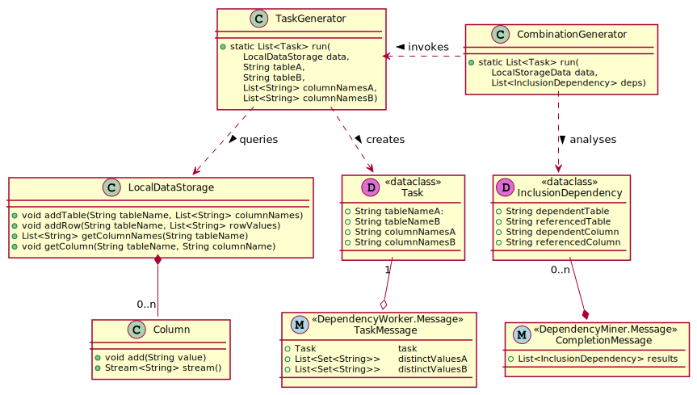

https://www.wdrmaus.de/blaubaer/filme/index.php5


# ddm-akka

## Compiling & running the system

Use Maven to build the project:

```sh
mvn package -f "pom.xml"
```

Then, extract the sample dataset:

```sh
cd data && unzip TPCH.zip && cd ..
```

Now the master system can be started like this:

```sh
java -Xmx3g -ea -cp target/ddm-akka-1.0.jar de.ddm.Main master
```

The system will run a while and shut down after it's finished. You  should receive output like this:

```sh
                akka://ddm/user/master/dependencyMiner| Before task delegation: 0 unassigned tasks
                akka://ddm/user/master/dependencyMiner| After task delegation: 0 unassigned tasks
                akka://ddm/user/master/dependencyMiner| Finished mining within 154548 ms!
akka://ddm/user/master/dependencyMiner/resultCollector| Received FinalizeMessage!
                                akka://ddm/user/reaper| Every local actor has been reaped. Terminating the actor system...
                                   Cluster(akka://ddm)| Cluster Node [akka://ddm@127.0.1.1:7877] - Marked address [akka://ddm@127.0.1.1:7877] as [Leaving]
                                   Cluster(akka://ddm)| Cluster Node [akka://ddm@127.0.1.1:7877] - Leader is moving node [akka://ddm@127.0.1.1:7877] to [Exiting]
                                   Cluster(akka://ddm)| Cluster Node [akka://ddm@127.0.1.1:7877] - Exiting completed
                                   Cluster(akka://ddm)| Cluster Node [akka://ddm@127.0.1.1:7877] - Shutting down...
                                   Cluster(akka://ddm)| Cluster Node [akka://ddm@127.0.1.1:7877] - Successfully shut down
  akka://ddm@127.0.1.1:7877/system/remoting-terminator| Shutting down remote daemon.
  akka://ddm@127.0.1.1:7877/system/remoting-terminator| Remote daemon shut down; proceeding with flushing remote transports.
  akka://ddm@127.0.1.1:7877/system/remoting-terminator| Remoting shut down.
```

The actual results can be viewed in the incrementally-created `results.txt` and `results.csv` files.

## How does it work

The system activities can be broadly split in 3 phases. While these phases boot up and finish sequentially, they will overlap and run in parallel.

### 1. Reading and storing the dataset

After reading in the table headers, the table rows will be read in batches until all tables have been completely read.

In order to reduce memory usage, individual table columns will be stored in an optimized data structure called `Column`.

When Column receives a value, it will compare it to all distinct values received so far and if it is already known, only store an index to it. These indicies will be used to read back the values in order. 

```
values stored in order:

    |"horse"|
    |"dog"  |
    |"dog"  |
    |"cat"  |
    |"horse"|

values stored in Column:

   distinct_values    indicies    readValue(index)
      |"horse"|         |0|        => "horse"
      |"dog"  |         |1|        => "dog"
      |"cat"  |         |1|        => "dog"
                        |2|        => "cat"
                        |0|        => "horse"

```

All data of all tables will be stored in the `LocalDataStorage` class. __NOTE: Currently, this is only an utility structure used by `DependencyMiner` - but in future it will be expanded to become a proper Akka actor. Each system will receive one such an actor to actively query and store data which it specifically requires.__

### 2. Generating tasks

Once a table has been fully read, it will be paired up with each previously fully-read table and passed on to the `TaskGenerator`. The `TaskGenerator` will generate one or more `Task`s based on each pairing.

A `Task` is a simple data structure, describing two tables and two respective selection of their columns which are to be checked for unary inclusion dependencies. 



Each `Task` will be turned into a `TaskMessage` when delegated. __NOTE: Currently, a Task message contains all unique values of the list columns in full. Once we get an incremental algorithm, as well as the LocalDataStorage actor working, our strategy of task generation may change significally.__
In order for `DependencyWorker.TaskMessage`'s to not become too large (which can very quickly trigger out-of-memory errors in Akka's serialization layer), the `Task`s will be generated to achieve a certain size limit (currently 80mb).

__NOTE: The current implementation of `TaskGenerator` is imprecise and does not fully utilize the size limit.__

### Case 1

If two tables `T1` and `T2` both fit in 80mb, one `Task` will be generated with all columns of each table selected:

* `(T1[*], T2[*])`

### Case 2

If table `T1` fits in 80mb, but table `T2` does not, multiple `Task`s will be generated. Each Task will select `T2` in full, while the selection of `T2` will be split: 

* `(T1[*], T2[X,Y])`
* `(T1[*], T2[Z,W])`

In total, `(T1[*], T2[*])` will be covered, with redundant coverage of `T1`.

### Case 3

If neither `T1` nor `T2` fit in 80mb, multiple Tasks will be generated. The selections for both `T1` and `T2` will be split and paired up in all permutations:

* `(T1[A,B], T2[X,Y])`
* `(T1[C,D], T2[Z,W])`
* `(T1[A,B], T2[X,Y])`
* `(T1[C,D], T2[Z,W])`

In total, `(T1[*], T2[*])` will be covered, with redundant coverage of both `T1` and `T2`.

### 3. Delegating tasks

__Master-Slave pattern__: The `DependencyMiner` keeps track of which `DependencyWorker` are busy and which are idle. Idle `DependencyWorker`s will be assigned a `Task`, which they will receive in a `TaskMessage`. While the `DependencyWorker` is busy, it will receive no other `Task`s.

When a `DependencyWorker` receives a `TaskMessage`, it checks for INDs with the following algorithm:

```python
for columnNameA, valueSetA in zip(columNamesA, distinctValuesA):
    for columnNameB, valueSetB in zip(columNamesB, distinctValuesB):
        if len(valueSetA) ≤ len(valueSetB) and valueSetB ⊆ valueSetA:
            pushResult(
                dependentTable=tableNameA,
                referencedTable=tableNameB,
                dependentColumn=columnNameA,
                referencedColumn=columnNameB)
        if len(valueSetB) ≤ len(valueSetA) and valueSetB ⊆ valueSetA:
            pushResult(
                dependentTable=tableNameB,
                referencedTable=tableNameA,
                dependentColumn=columnNameB,
                referencedColumn=columnNameA)
```

The results then get sent back in a `CompletionMessage` to the `DependencyMiner`. This is currently all a `DependencyMiner` does.

### 4. Reporting the results

The results get reported in both the files `results.txt` and `results.csv`. The former will contain the INDs in a human readable form, the latter as a CSV table.


[`Column`]: ./src/main/java/de/ddm/structures/Column.java
[`LocalDataStorage`]: ./src/main/java/de/ddm/structures/LocalDataStorage.java
[`Task`]: ./src/main/java/de/ddm/structures/Task.java
[`TaskGenerator`]: ./src/main/java/de/ddm/structures/TaskGenerator.java
[`DependencyMiner`]: ./src/main/java/de/ddm/actors/profiling/DependencyMiner.java
[`DependencyWorker`]: ./src/main/java/de/ddm/actors/profiling/DependencyWorker.java
